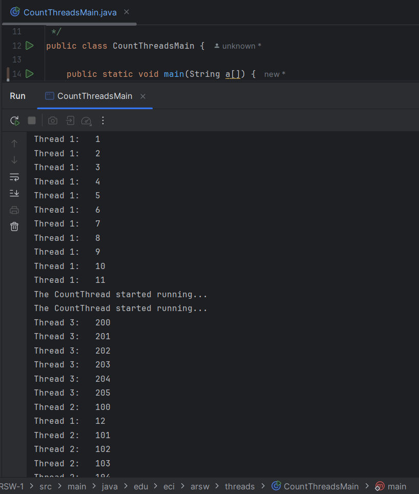
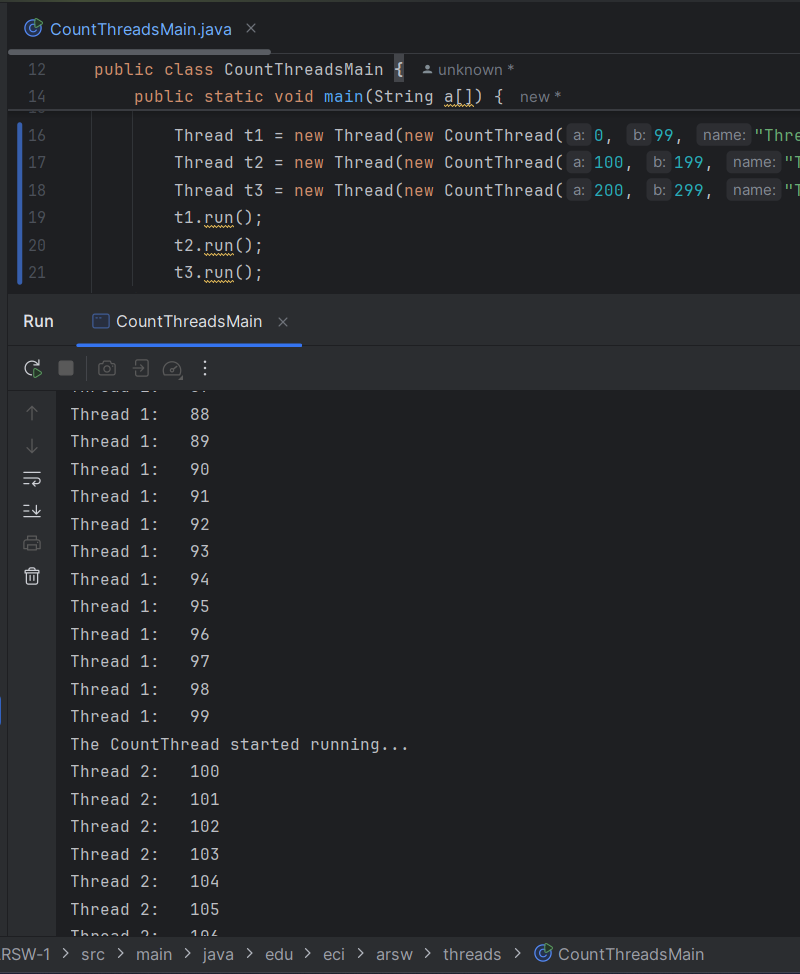

# Resolución Laboratorio 1

## Tabla de Contenido
1. [Integrantes](#integrantes)
2. [Introducción](#introducción)
3. [Procedimiento](#procedimiento)
    - [Hilos en Java](#hilos-en-java)
        1. [Parte I](#parte-i)
        2. [Parte II](#parte-ii)
        3. [Parte III - Evaluación de Desempeño](#evaluación-de-desempeño)
4. [Conclusiones](#conclusiones)

---

## Integrantes
- Santiago Avellaneda
- Miguel Motta

---

## Introducción
[Aquí va la introducción]

---

## Procedimiento

### Hilos en Java

---

### Parte I
> 1. De acuerdo con lo revisado en las lecturas, complete las clases CountThread, para que las mismas definan el ciclo de vida de un hilo que imprima por pantalla los números entre A y B.
> 2. Complete el método main de la clase CountMainThreads para que:
> - Cree 3 hilos de tipo CountThread, asignándole al primero el intervalo `[0..99]`, al segundo `[99..199]`, y al tercero `[200..299]`.
> - Inicie los tres hilos con `start()`. 
> - Ejecute y revise la salida por pantalla.
> - Cambie el incio con `start()` por `run()`. Cómo cambia la salida?, por qué?.

### Solución

#### *Clase de Count Thread*
```
> public class CountThread implements Runnable{
    private  int a;
    private  int b;
    private String name;
    public CountThread(int a, int b, String name) {
        // Constructor ...
    }

    @Override
    public void run() {
        System.out.println("The CountThread started running...");
        print();
    }

    private void print(){
        for (int i = a; i <= b; i ++ ){
            System.out.println(name + ":\t" + i);
        }
    }
}
> ```

#### *Clase de Count Threads Main*
```
public class CountThreadsMain {    
    public static void main(String a[]) {
        Thread t1 = new Thread(new CountThread(0, 99, "Thread 1"));
        Thread t2 = new Thread(new CountThread(100, 199, "Thread 2"));
        Thread t3 = new Thread(new CountThread(200, 299, "Thread 3"));
        t1.start();
        t2.start();
        t3.start();
    }
}
```

Al ejecutar la clase `CountThreadsMain`, se crean 3 hilos de `CountThread` 
que se ejecutan concurrentemente, lo que se puede observar en la salida de 
ejecución, ya que los números no se imprimen en el orden secuencial que se 
esperaría, sino que cada hilo avanza de manera independiente.



Al intercambiar la sentencia de ejecución `start()` por `run()`, se está llamando 
el método `run()` de la clase `CountThread` sin iniciar el hilo, por lo que su 
comportamiento será secuencial, de modo que la salida al cambiar esta sentencia,
debería ser diferente y reflejar un comportamiento secuencial y no concurrente:

```
public class CountThreadsMain {
    public static void main(String a[]) {
        Thread t1 = new Thread(new CountThread(0, 99, "Thread 1"));
        Thread t2 = new Thread(new CountThread(100, 199, "Thread 2"));
        Thread t3 = new Thread(new CountThread(200, 299, "Thread 3"));
        t1.run();
        t2.run();
        t3.run();
    }
}
```


#### Parte II

#### Evaluación de Desempeño
[Aquí va la descripción de la evaluación de desempeño]

---

## Conclusiones
[Aquí van las conclusiones]
